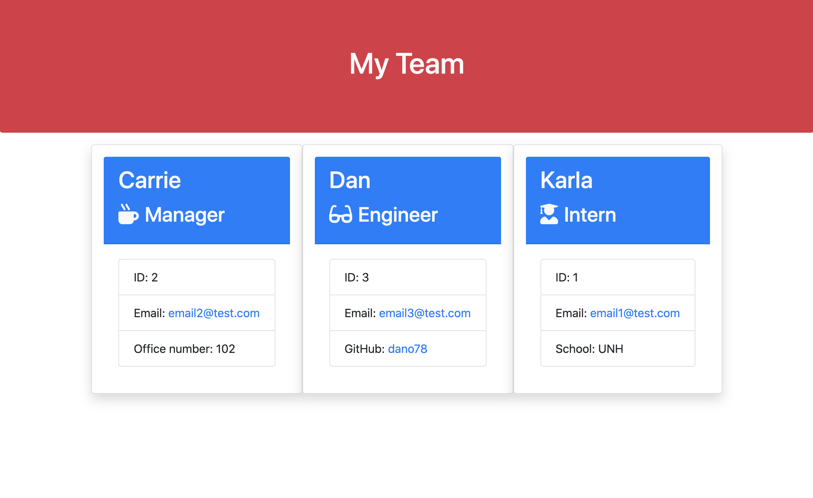
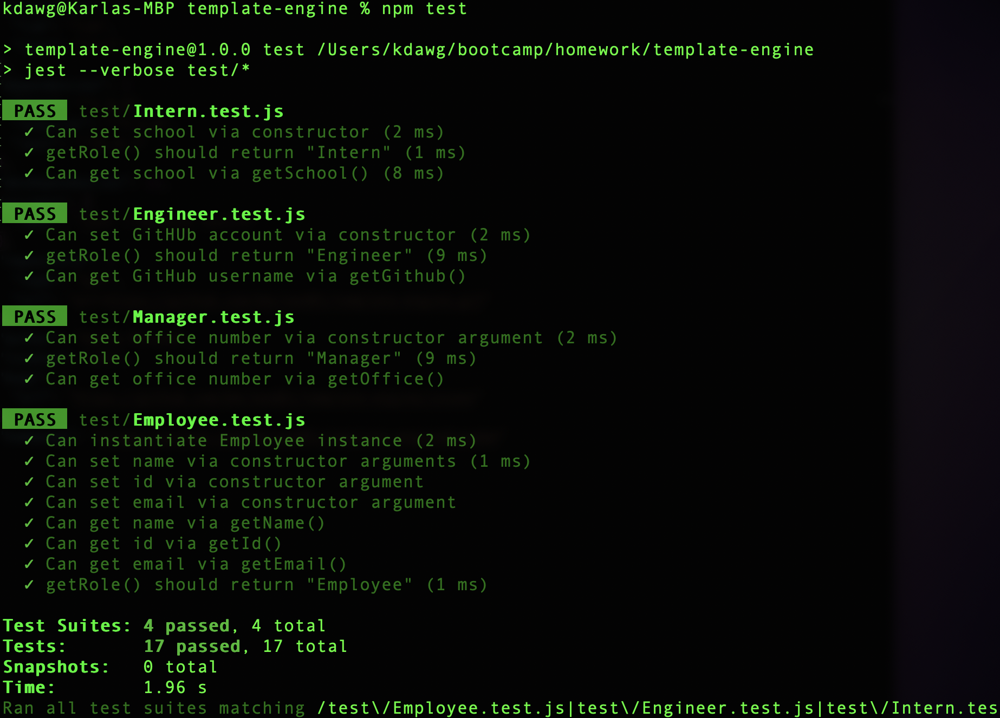

# template-engine

## Table of Contents:
* [Description](##Description)
* [How to Install](##How-to-Install)
* [Usage](##Usage)
* [Tests](##Tests)
* [Contributors](##Contributors)
* [Link to Page](##Link-to-Page)

## Description
This application is used to create a team hierarchy that displays through the browser that can keep track of your team and thier information.

## How to Install
run: `npm install` in your terminal/bash, then `node app`

## Usage
The user will be promted to enter thier information once installing the application. Once the questions are completed, a team.html page will be generated in the output folder. This can be viewed in the browser where their information will be displayed.

## Tests
4 tests were used using jest for this application.

## Contributors
* **Karla McLeod** - [kmcleod81](https://github.com/kmcleod81)

## Link to Page
* https://kmcleod81.github.io/template-engine/